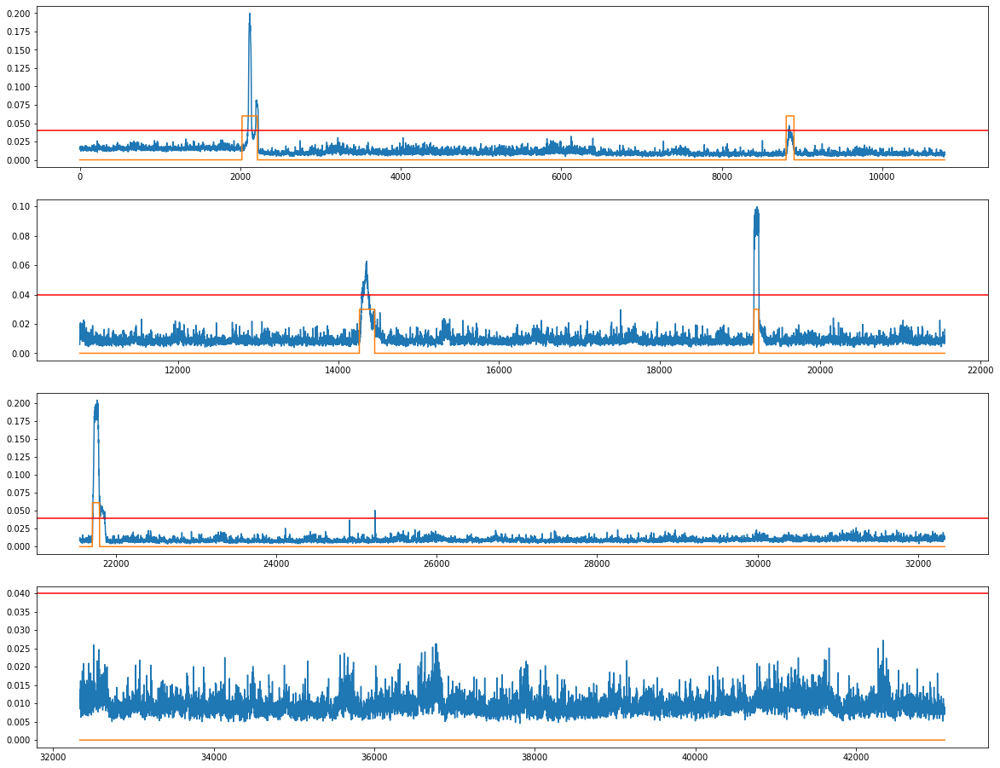
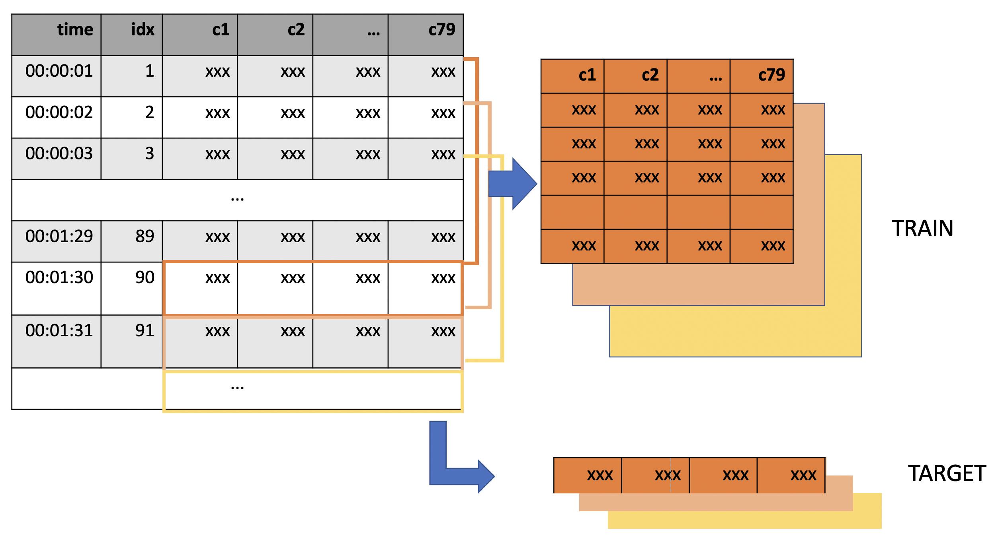

# 2020_anomaly_detection

# 개요 - 데이콘 대회

최근 국가기반시설 및 산업시설의 제어시스템에 대한 사이버 보안위협이 지속적으로 증가하고 있습니다.국가 중요시설에 대한 사이버 공격은
국가와 사회에 돌이킬 수 없는 막대한 피해를 일으킬 수 있어, 세계 각국은 이에 대한 보안기술 개발에 전념하고 있습니다.
특히, 현장 제어시스템의 특성을 정확하게 반영하고, 다양한 제어시스템 사이버공격 유형을 포함하는 데이터셋은
AI기반 보안기술 연구를 위한 필수적인 요소입니다. 국가보안기술연구소는 GE, Emerson, Siemens 등 산업용 제어기기, 센서, 액추에이터를 이용해
제어시스템 테스트베드를 구축하였고, 이를 기반으로 산업제어시스템 보안 데이터셋 HAI 1.0을 개발하여 2020년 2월에 공개(https://github.com/icsdataset/hai) 하였습니다. 아울러, 이를 개선한 HAI 2.0 데이터셋도 HAICon 2020에서 공개할 예정입니다.
HAICon 2020은 국내 최초로 산업제어시스템 보안연구를 위해 만들어진 HAI 데이터셋을 활용하여 정상 상황의 데이터만을 학습하여 공격 및 비정상 상황을 탐지할 수 있는 최신의 머신러닝, 딥러닝 모델을 개발하고 성능을 경쟁하는 대회입니다.

https://dacon.io/competitions/official/235624/overview/description

# Result

# 기술

Python, numpy, pandas, tensorflow 2.x

# 기술

Python, numpy, pandas, tensorflow 2.x

# 기간

2020.08-2020.09

# Data : Tablur

columns : 79 anonymous columns
target : None

# Preprocess

make 2D dataset to 3D tensor.

# model : Bidirectional LSTM

x
